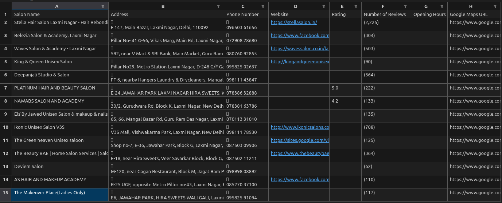

# 💇‍♀️ Find Salon Near Me

[](https://www.python.org/downloads/)
[](LICENSE)
[](https://www.selenium.dev/)
[](https://github.com/Purushottam1024/find-salon-near-me/issues)

A Python automation tool that uses Selenium to search for salons in any city using Google Search and exports the results into an Excel file.

---

## 📸 Example Output

Here’s what the generated Excel sheet looks like:

 <sub>*Example shows extracted salon data with names, ratings, and locations.*</sub>

---

## 🚀 Features

* ✅ Google search for salon listings
* ✅ Automatically scrolls the page
* ✅ Extracts names, addresses, ratings, and links
* ✅ Saves output as `.xlsx`
* ✅ Cross-platform with `webdriver-manager`
* ✅ Can be used as both CLI tool and Python module

---

## 🛠️ Requirements

* Python 3.7+
* Google Chrome installed
* `chromedriver` (automatically managed)

---

## 🗖️ Installation

### Option 1: Manual Setup

```bash
git clone https://github.com/Purushottam1024/find-salon-near-me.git
cd find-salon-near-me
python3 -m venv salonenv
source salonenv/bin/activate  # Windows: salonenv\Scripts\activate
pip install .
```

### Option 2: Automated Setup via `install.py`

The repository also includes an `install.py` script that automates the environment creation and package installation.

```bash
python3 install.py
```

After running `install.py`, activate the environment using the alias printed in the terminal (e.g. `salonenv`) and then run the tool:

```bash
find-salon --query "salons near me" --scrolls 5 --output mumbai_salons.xlsx
```

---

## 📋 Usage

### 🔧 CLI Usage

```bash
find-salon --query "salons near Mumbai" --scrolls 5 --output mumbai_salons.xlsx
```

### 🐍 Python Usage

```python
from find_salon.scraper.driver import get_driver
from find_salon.scraper.search import search_places
from find_salon.scraper.excel import save_to_excel

driver = get_driver()
results = search_places(driver, "salons near Mumbai", 5)
driver.quit()
save_to_excel(results, "mumbai_salons.xlsx")
```

| Argument    | Description                                    |
| ----------- | ---------------------------------------------- |
| `--query`   | Search query to run on Google                  |
| `--scrolls` | Number of times to scroll to load more results |
| `--output`  | Path to save the Excel output file             |

---

## 🧫 Project Structure

```text
find-salon-near-me/
├── find_salon/
│   ├── main.py                  # CLI entry point
│   └── scraper/
│       ├── driver.py            # Handles Chrome driver setup
│       ├── excel.py             # Excel export logic
│       ├── extractor.py         # Extracts data from Google Maps
│       └── search.py            # Search and scroll logic
├── assets/
│   └── example-output.png       # Sample Excel screenshot
├── install.py                  # Script to create venv and install package
├── LICENSE
├── readme.MD
├── requirements.txt
└── setup.py
```

---

## 🥪 CLI Tool Packaging

This project is already CLI-enabled. After installing with `pip install .`, just run:

```bash
find-salon --query "salons in Delhi" --scrolls 5 --output delhi_salons.xlsx
```

---

## ⚙️ Troubleshooting

* ⚡ If you get `[Errno 8] Exec format error`, ensure `chromedriver` is executable. The script handles this automatically.
* 🔊 Ensure Google Chrome is installed and matches `chromedriver` version.
* ⛔ Avoid excessive scrolling to prevent CAPTCHA.

---

## ✍️ Author

**Purushottam Prabhakar**
[GitHub](https://github.com/Purushottam1024)
Email: [purushottam.prab@gmail.com](mailto:purushottam.prab@gmail.com)

---

## 📄 License

This project is licensed under the MIT License. See the [LICENSE](LICENSE) file for more details.
